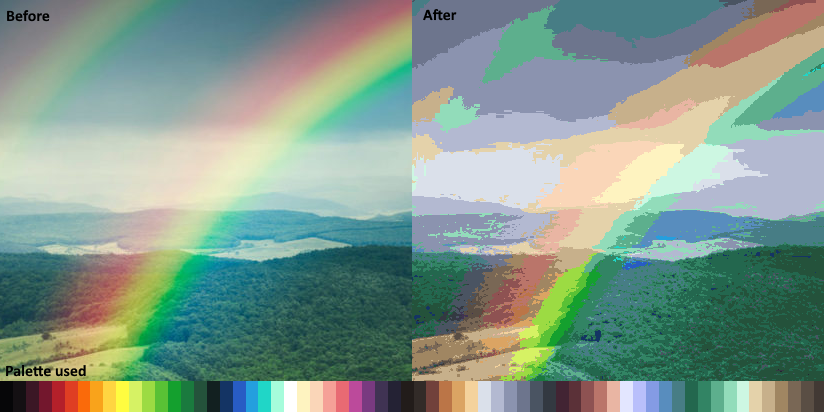

### Apply palette to Image
  
Applies the colors from a color palette to any image  
  


### How to use
  
first arg is palette image path.
  
```java ./PaletteConverter.java palettes/aap-64-1x.png```  
  
will convert all files inside input folder.